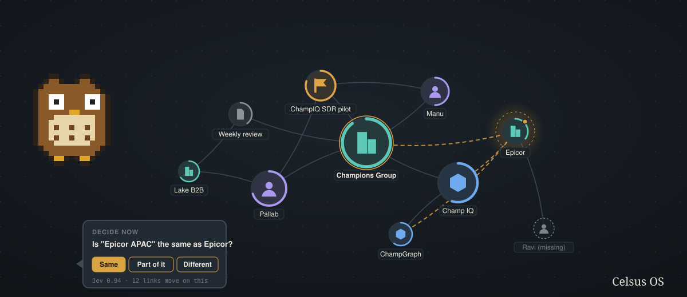

<p align="center"></p>

<h1 align="center">Celsus OS</h1>
<p align="center"><b>A knowledge base OS for your Obsidian vault.</b><br>Understand what you have, make the connections you missed, improve it one small decision at a time, and add the context that is missing. With a pixel owl doing the asking.</p>

<p align="center">
<a href="#install">Install</a> ·
<a href="#the-loop">The loop</a> ·
<a href="#what-you-see">What you see</a> ·
<a href="#how-it-learns">How it learns</a> ·
<a href="#privacy">Privacy</a> ·
<a href="TESTING.md">Testing guide</a> ·
<a href="docs/REFERENCE.md">Full reference</a> ·
<a href="CONTRIBUTING.md">Contributing</a>
</p>

---

Most second brains fill up faster than they get understood. Names drift ("Kethan", "Ketan", "K. Reddy"), the same company gets three notes, a person is linked from forty places and has no note at all, and the relationships you actually care about never get a line drawn between them.

Celsus OS sits next to your vault and works through that with you. It reads every note, maps the vault as a living graph, and turns the mess into short questions: *is "Epicor APAC" the same as Epicor? should this effort link to that product? is this copy safe to archive?* You answer with one key. It learns how you decide and stops asking about things it already knows. And when you want to understand something, you ask the owl, who answers in small interface blocks (stats, entity cards, tables, decisions you can take on the spot) rather than a wall of text.

Zero dependencies. One Node process. Your notes never leave your machine; only names and titles go to the classifier.

## Install

One line on macOS or Linux (needs git and Node 22.18 or newer):

```sh
curl -fsSL https://raw.githubusercontent.com/Champ-Deep/celsus-os/main/install.sh | sh
```

Then:

```sh
celsus setup     # paste your OpenRouter key, point it at your vault, pick a model (a free one is the default)
celsus doctor    # checks the machine end to end
celsus run       # first pass over the vault, about 4 minutes for 3,000 notes
celsus serve     # http://localhost:3043
```

Prefer a clone? `git clone https://github.com/Champ-Deep/celsus-os.git && cd celsus-os && node cli.ts setup`. Every `celsus` command is `node cli.ts` in the clone. `celsus update` pulls the latest version.

You need one thing: an [OpenRouter](https://openrouter.ai) key. It pays for Jev (the classifier, about two cents for a whole vault pass) and, unless you run a local model, the narrator. The default narrator is free.

## The loop

Celsus runs four verbs over your vault, in order, and each one is a screen.

| Verb | What happens | Where |
|---|---|---|
| **Understand** | The vault becomes a graph. Node size is how linked a note is (log scale), the ring is how complete it is, the icon is what kind of thing it is, and a halo means there is a decision waiting. Click anything and the owl tells you what it is connected to and what is pending. Ask a question and get an answer made of blocks. | Graph |
| **Connect** | The normalizer resolves every mention to a canonical note (misspellings, initials, spacing, aliases), and Jev judges the ambiguous ones. A second pass finds pairs of notes that never link but clearly should, and suggests which company an effort belongs to. | Graph, Decide |
| **Improve** | Every unresolved question becomes a flashcard: one at a time, keys 1 to 4, the recommended answer filled in when Jev is confident, and one line on why you are seeing it. Duplicates get an Archive button that moves the copy out of the graph and into a dated folder you can restore from. Nothing is ever deleted from disk. | Decide, Duplicates |
| **Add context** | Missing notes (things linked from everywhere that have no note) are ranked by how many links point at them. Create one from two lines of context: Laya, the writing model, fills your vault template and links what it recognises; Jev checks it is complete enough; you answer what is still missing and save. | Missing notes |

## What you see

**Graph.** The whole vault (the most linked entities and the edges between them) or one entity's neighbourhood, with physics you can drag. Filter by kind, toggle suggested edges, pick 1 or 2 hops. Three looks: tinted, glow, discs.

**Ask bar.** Type a name and Enter maps it; type a question and Enter asks. The subject chip on the left is what follow ups are about, so "who introduced them?" stays about the company you were looking at.

**The owl.** A pixel mascot (five species, nine looks, all original, pick yours in Settings) that thinks, speaks, asks and celebrates. Its bubble is where answers land, where node summaries appear, and where you take decisions in place.

**Decide.** One card. Why you are seeing it. Four answers. What the store has learned so far, and the decisions it made for you, with undo.

**Missing notes, Duplicates, Rules.** The three hygiene screens. Rules shows the patterns that have become standing rules, lets you add a note in your own words to any of them, and shows how many training examples Laya has.

## How it learns

Every answer is appended to a label log and updates a rule store keyed by the shape of the question (matcher, kinds, what Jev said). A rule with five consistent answers at 0.90 confidence starts deciding on its own; those decisions are listed with undo, and an undo lowers the rule. After each answer the store is rewritten as a readable note in your vault, `Decision Policy.md`, and the standing rules are briefed to Jev as state on the next run, so the classifier is told how you decide before it decides.

The same store trains Laya, the local writing model. `runs/laya/` holds a system prompt, a training set in chat format, and an Ollama Modelfile, regenerated after every answer. `ollama create celsus-laya -f runs/laya/Modelfile` refreshes the local model; point Settings at it and the narrator runs on your machine.

## Privacy

The classifier (Jev, by TypeSafe, through OpenRouter) receives names and titles only, never note bodies. The narrator receives dossiers: names, kinds, counts and pending questions, never note text. Your key lives in `~/.celsus-os/config.json`, outside the vault. Every run writes to `Efforts/Active/Celsus OS/runs/<date>/` in your vault, and the app only ever writes three things to the vault itself: new notes you save, the policy note, and archive moves.

## Models

| Role | Default | Options |
|---|---|---|
| Classifier | `typesafe/jev-1.13` | fixed; every decision has a full probability distribution |
| Narrator and writer (Laya) | `stealth/space-bunny-alpha` (free while its tag is live) | any OpenRouter model, or a local endpoint (Ollama, LM Studio) |
| Local base for Laya | `llama3.1` | any tag you have pulled (`layaBase` in config) |

## For a team

Each person installs, runs `celsus setup` against their own vault with their own key, and gets their own graph, deck and rules. Nothing is shared by default. The `TESTING.md` guide is the walk through to hand to a teammate on day one.

## Contributing and the next front end

The front end is one file, `ui/index.html`, plus `ui/mascot.js`, served by `serve.ts`. A redesign drops in by replacing those two files; the API contract, screen list and every UI state are documented in `CONTRIBUTING.md`. Pull requests welcome.

## Files

| File | Role |
|---|---|
| `cli.ts`, `bin/celsus`, `install.sh` | Entry points |
| `setup.ts`, `doctor.ts`, `config.ts` | First run, checks, config outside the vault |
| `vault.ts`, `glossary.ts`, `match.ts`, `jev.ts`, `llm.ts` | Vault walker, entity registry, fuzzy matcher, Jev client, LLM client |
| `normalize-entities.ts`, `suggest-owners.ts`, `suggest-links.ts`, `find-duplicates.ts` | The four passes of `celsus run` |
| `policy.ts`, `notes.ts`, `archive.ts`, `narrate.ts` | Rule store and Laya exports, note drafting, the archive, cached narrations |
| `serve.ts`, `ui/` | The local app |

MIT licensed. Built by [Champions Accelerator](https://github.com/Champ-Deep) for people whose vaults grew faster than their memory.
